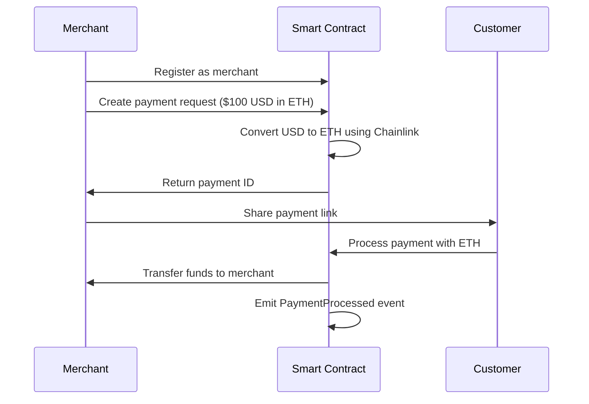

# WalletWave 🌊

A decentralized cryptocurrency payment gateway built on Ethereum that enables merchants to create payment requests and customers to pay in ETH, BTC (wrapped), or USDC. Built with Solidity smart contracts and a modern React frontend.

## 🌟 Features

### For Merchants
- **One-time Registration**: Register as a merchant to start accepting payments
- **Multi-currency Support**: Accept payments in ETH, BTC, or USDC
- **USD-denominated Payments**: Set prices in USD, automatically converted to crypto
- **Expiring Payment Links**: Generate shareable links with customizable validity (5 min to 24 hours)
- **Real-time Tracking**: Monitor payment status with auto-updating dashboard
- **Smart Sorting**: Pending payments appear first, completed payments last

### For Customers
- **Simple Payment Flow**: Pay with just a few clicks
- **Wallet Integration**: Connect with MetaMask, WalletConnect, and other popular wallets
- **Live Countdown**: See time remaining before payment link expires
- **Payment Confirmation**: Instant on-chain verification

### Technical Features
- **Chainlink Price Feeds**: Real-time crypto price data for accurate conversions
- **Smart Contract Architecture**: Secure, auditable payment processing
- **Gas Optimized**: Efficient storage and execution patterns
- **Event Emission**: Full transaction history via blockchain events
- **Refund Support**: Built-in refund mechanism for merchants

## 📦 Project Structure

```
walletwave/
├── src/                    # Solidity smart contracts
│   ├── PaymentGateway.sol      # Main payment processing contract
│   ├── MerchantRegistry.sol    # Merchant registration & management
│   ├── PriceOracle.sol         # Chainlink price feed integration
│   ├── PaymentUtils.sol        # Shared utilities and data structures
│   └── IPaymentGateway.sol     # Interface definitions
├── frontend/               # React application
│   ├── src/
│   │   ├── components/         # React components
│   │   ├── contracts/          # Contract ABIs and addresses
│   │   ├── pages/              # Page components
│   │   └── wagmi.ts           # Web3 configuration
│   └── vercel.json            # Vercel deployment config
├── script/                 # Deployment scripts
├── test/                   # Smart contract tests
└── broadcast/              # Deployment artifacts
```

## 🚀 Quick Start

### Prerequisites

- [Foundry](https://book.getfoundry.sh/getting-started/installation) for smart contract development
- [Node.js](https://nodejs.org/) v18+ for frontend
- [MetaMask](https://metamask.io/) or another Web3 wallet

### Smart Contract Setup

1. **Install Foundry dependencies:**
```bash
forge install
```

2. **Compile contracts:**
```bash
forge build
```

3. **Run tests:**
```bash
forge test
```

4. **Deploy to Sepolia testnet:**
```bash
forge script script/DeploymentScript.s.sol --rpc-url $SEPOLIA_RPC_URL --broadcast --verify
```

### Frontend Setup

1. **Navigate to frontend directory:**
```bash
cd frontend
```

2. **Install dependencies:**
```bash
npm install
```

3. **Configure WalletConnect:**
   - Visit [WalletConnect Cloud](https://cloud.walletconnect.com)
   - Create a free project
   - Copy your Project ID
   - Update `src/wagmi.ts` with your Project ID

4. **Start development server:**
```bash
npm run dev
```

5. **Build for production:**
```bash
npm run build
```

## 🔗 Deployed Contracts (Sepolia Testnet)

| Contract | Address |
|----------|---------|
| **PaymentGateway** | `0xCD30af277c308C12E6164EF5720dAFC0F7385AD5` |
| **MerchantRegistry** | `0x3FA38C1B92dE06c744784B18DEf8C3088E1C96f1` |
| **PriceOracle** | `0x8E0518C9252227dCAa47492E1691DF83bA436a95` |

**Network**: Sepolia Testnet (Chain ID: 11155111)

**Get Testnet ETH:**
- [Sepolia Faucet](https://sepoliafaucet.com/)
- [Alchemy Faucet](https://www.alchemy.com/faucets/ethereum-sepolia)

## 🎯 How It Works

### Payment Flow



### Key Components

#### 1. PaymentGateway.sol
The core contract handling:
- Payment creation with USD amounts
- Token-to-USD conversion via Chainlink
- Payment processing for ETH and ERC20 tokens
- Payment expiration logic
- Merchant withdrawals

#### 2. MerchantRegistry.sol
Manages merchant accounts:
- Registration with business name and email
- Merchant activation/deactivation
- Fee structure management
- Merchant payment tracking

#### 3. PriceOracle.sol
Chainlink integration for:
- Real-time ETH/USD prices
- BTC/USD prices
- USDC/USD prices
- Automatic price feed updates

## 💻 Tech Stack

### Smart Contracts
- **Solidity** 0.8.28
- **Foundry** - Development framework
- **OpenZeppelin** - Security contracts
- **Chainlink** - Price feeds

### Frontend
- **React** 19 + **TypeScript**
- **Vite** - Build tool
- **Wagmi** v2 - Ethereum React hooks
- **RainbowKit** - Wallet connection
- **TanStack Query** - Data fetching
- **Framer Motion** - Animations
- **React Router** - Navigation

### Deployment
- **Vercel** - Frontend hosting
- **Sepolia** - Testnet deployment

## 📖 Usage Examples

### Creating a Payment Request (Merchant)

```typescript
// Connect wallet and register as merchant (one-time)
await registerMerchant("My Business", "contact@mybusiness.com")

// Create a $100 payment request in ETH, valid for 30 minutes
const usdAmount = BigInt(100 * 1e8) // $100 in 8 decimals
const validity = 1800 // 30 minutes in seconds
await createPayment(ETH_ADDRESS, usdAmount, validity)
```

### Processing a Payment (Customer)

```typescript
// Customer receives payment ID from merchant
const paymentId = "0x..."

// Get payment details
const payment = await getPayment(paymentId)

// Pay with ETH
await processPayment(paymentId, { value: payment.amount })
```

## 🔐 Security Features

- ✅ **Reentrancy Protection**: Uses OpenZeppelin's ReentrancyGuard
- ✅ **Access Control**: Role-based permissions for critical functions
- ✅ **Expiration Checks**: Automatic validation of payment validity
- ✅ **Integer Overflow Protection**: Solidity 0.8+ built-in checks
- ✅ **Event Logging**: Complete audit trail via events
- ✅ **Pausable**: Emergency stop mechanism

## 🧪 Testing

```bash
# Run all tests
forge test

# Run tests with gas reporting
forge test --gas-report

# Run specific test file
forge test --match-path test/PaymentGateway.t.sol

# Run with verbosity for detailed output
forge test -vvv
```

## 🚢 Deployment

### Deploy to Sepolia

1. **Set up environment variables:**
```bash
export SEPOLIA_RPC_URL="your_rpc_url"
export PRIVATE_KEY="your_private_key"
export ETHERSCAN_API_KEY="your_etherscan_key"
```

2. **Run deployment script:**
```bash
forge script script/DeploymentScript.s.sol \
  --rpc-url $SEPOLIA_RPC_URL \
  --broadcast \
  --verify
```

3. **Update frontend config:**
   - Copy deployed addresses
   - Update `frontend/src/contracts/config.ts`

### Deploy Frontend to Vercel

1. **Push to GitHub:**
```bash
git add .
git commit -m "Deploy to Vercel"
git push origin main
```

2. **Configure Vercel:**
   - Import your GitHub repository
   - Set root directory to `frontend`
   - Vercel will auto-detect Vite configuration
   - Deploy!

The `vercel.json` file ensures proper SPA routing.

## 🛠️ Configuration

### Smart Contract Configuration

Update `script/DeploymentScript.s.sol`:
```solidity
// Chainlink price feed addresses (Sepolia)
address constant ETH_USD_FEED = 0x694AA1769357215DE4FAC081bf1f309aDC325306;
address constant BTC_USD_FEED = 0x1b44F3514812d835EB1BDB0acB33d3fA3351Ee43;
```

### Frontend Configuration

Update `frontend/src/wagmi.ts`:
```typescript
const config = getDefaultConfig({
  appName: 'WalletWave',
  projectId: 'YOUR_WALLETCONNECT_PROJECT_ID',
  chains: [sepolia],
})
```

## 📊 Smart Contract Events

The contracts emit comprehensive events for tracking:

```solidity
event PaymentCreated(bytes32 indexed paymentId, address merchant, uint256 amountUSD)
event PaymentProcessed(bytes32 indexed paymentId, address customer, uint256 amount)
event PaymentExpired(bytes32 indexed paymentId)
event PaymentRefunded(bytes32 indexed paymentId, uint256 amount)
event MerchantRegistered(address indexed merchant, string businessName)
```

## 🤝 Contributing

Contributions are welcome! Please follow these steps:

1. Fork the repository
2. Create a feature branch (`git checkout -b feature/amazing-feature`)
3. Commit your changes (`git commit -m 'Add amazing feature'`)
4. Push to the branch (`git push origin feature/amazing-feature`)
5. Open a Pull Request

## 📝 License

This project is licensed under the MIT License.

## 🙏 Acknowledgments

- [Chainlink](https://chain.link/) for reliable price feeds
- [OpenZeppelin](https://openzeppelin.com/) for secure contract libraries
- [Foundry](https://getfoundry.sh/) for excellent development tools
- [RainbowKit](https://www.rainbowkit.com/) for seamless wallet integration

## 📧 Contact

For questions or support, please open an issue on GitHub.

---

**Built with ❤️ for the decentralized future**
